# 🌊 BeachBuddy

**BeachBuddy** is a smart beach companion app for Android that empowers coastal travelers with real-time safety and discovery features. It integrates live marine data, maps, and rich media to help users explore nearby beaches and decide when it's safe to swim, surf, or simply enjoy the coast. Built using Android Studio and REST APIs, BeachBuddy combines beauty with function for a seamless beach planning/visit experience.

---

## 🧰 Tech Stack

| Technology                | Purpose                                                                    |
| ------------------------- | -------------------------------------------------------------------------- |
| **Kotlin**                | Primary programming language.                        |
| **XML**                   | Designing the UI layout for activities and fragments                       |
| **Architecture**    | Model-View-ViewModel(MVVM) for a strong focus on Lifecycle Management.             |
| **Google Maps SDK**       | Displaying map with real-time markers and user location                    |
| **Retrofit + Kotlin Coroutines** | Making asynchronous API calls for weather and location data                |
| **Open-Meteo API**        | Fetching real-time marine and general climate/weather data |
| **Foursquare API**        | Discovering beaches within a certain radius of user’s location                                   |
| **Unsplash API**          | Fetching high-quality beach images                                         |
| **Glide**                 | Loading and caching images efficiently                                     |

---

## 🌟 Features

### ⚙️ Core Functionality

- **🌐 Beach Discovery via APIs**  
  Beaches near the user's current location are fetched dynamically using the **Foursquare Places API**, shown both on a **Google Map** and a **RecyclerView list**.

- **🧠 Safety Classification Engine**  
  A centralized Kotlin class processes real-time marine data (wave height, wave period, water temperature, and current velocity) fetched via the **Open-Meteo Marine Weather API**, and assigns each beach a safety level (Safe, Caution, Dangerous). This logic is reusable and used throughout the app (Map, List, Details).

- **🗺️ Google Maps Integration**  
  The map displays color-coded markers representing each beach’s current safety level. Tapping a marker brings up more info, while markers update in real time when the user changes location.

- **📥 Location Flexibility**  
  Users can change their current Location using a filter and view beaches near that particular location.

- **📡 Asynchronous Data Handling**  
  All network operations (Foursquare, Open-Meteo, Unsplash) are performed using **Retrofit** with **Kotlin Coroutines**, ensuring seamless and non-blocking UI experiences.

- **🔄 State Restoration**  
  ViewModels combined with LiveData ensure that app state (like map camera position, selected beach, and tracked beaches) persists across configuration changes like screen rotations.

---

### 🧠 Safety Classification Reference

BeachBuddy uses a color-coded classification engine for quick beach safety evaluation:

| Classification Level | Description              | Marker Color |
|----------------------|--------------------------|--------------|
| **Safe**             | Ideal for swimming/surfing | 🟢 Green     |
| **Caution**          | Mild risk   | 🟡 Yellow    |
| **Dangerous**        | Unsafe for most activities| 🔴 Red       |


---

## 🖼️ App Screenshots

### 🔹 Start Screen

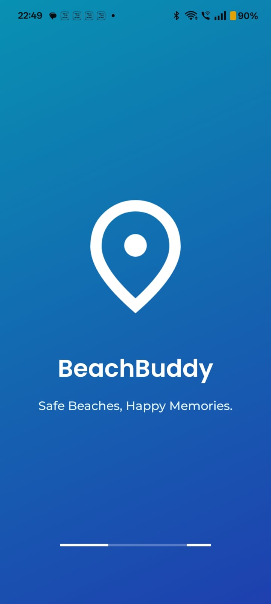

### 🔐 Authentication

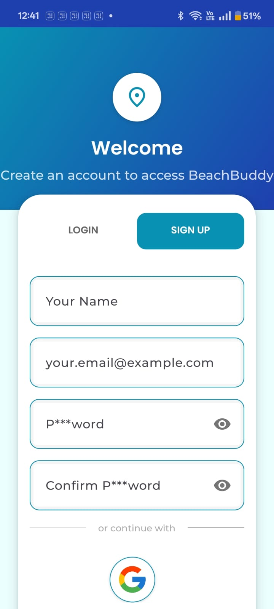 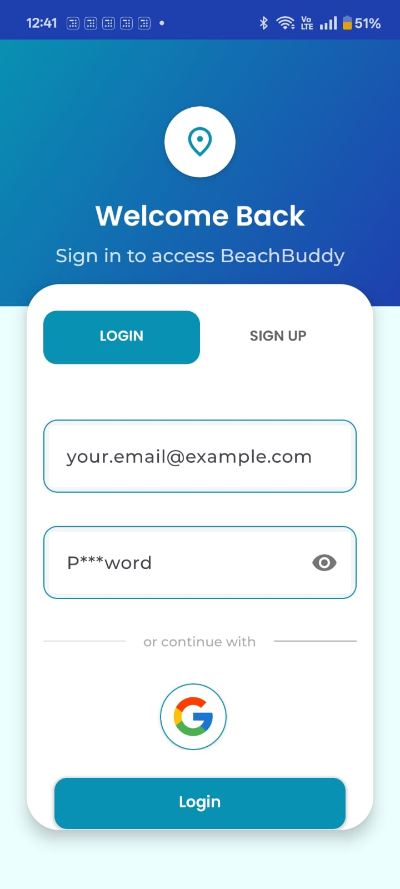

### 🏝️ Home Screen (Map + List)

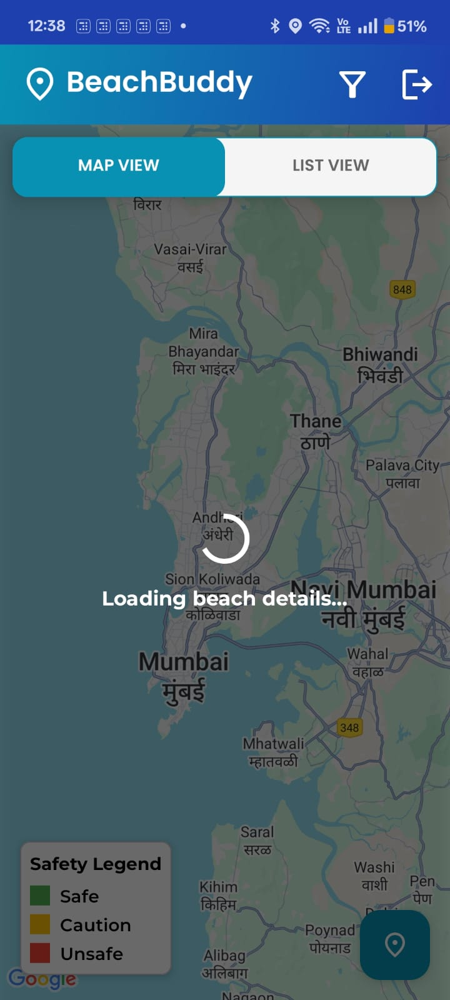 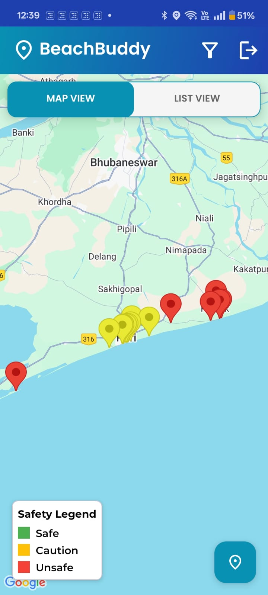 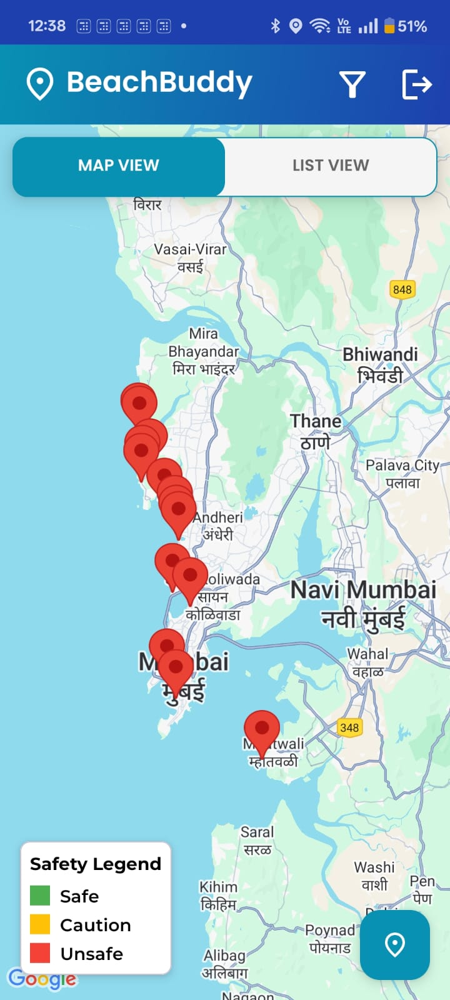 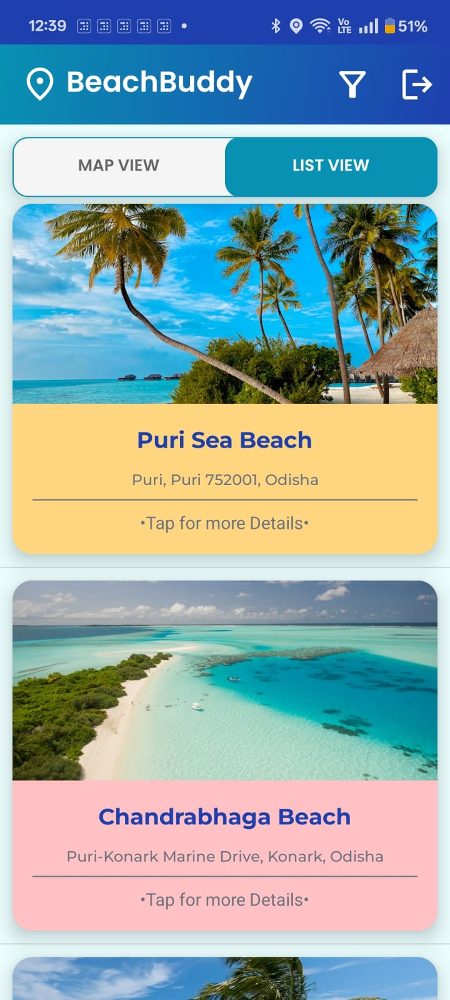 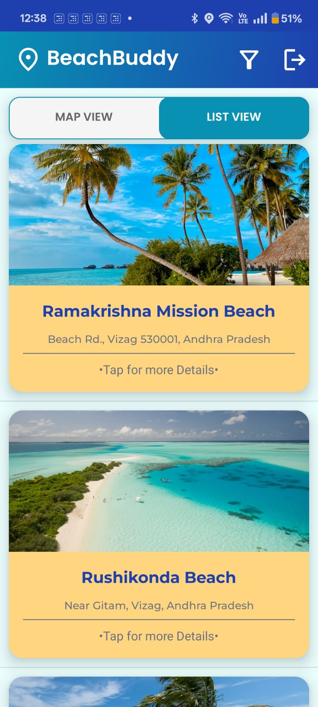 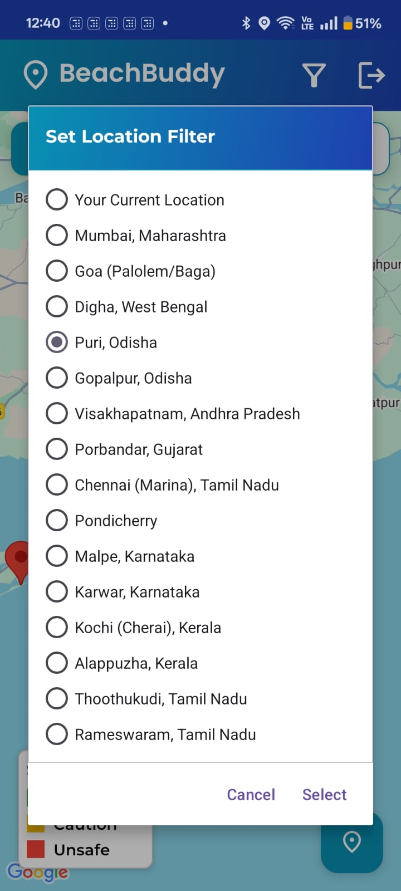
### 📍 Beach Details View

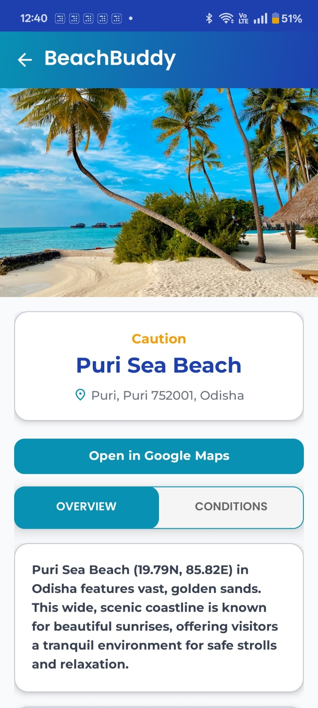 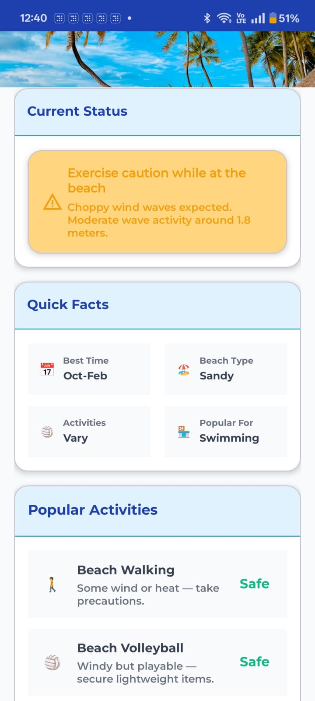 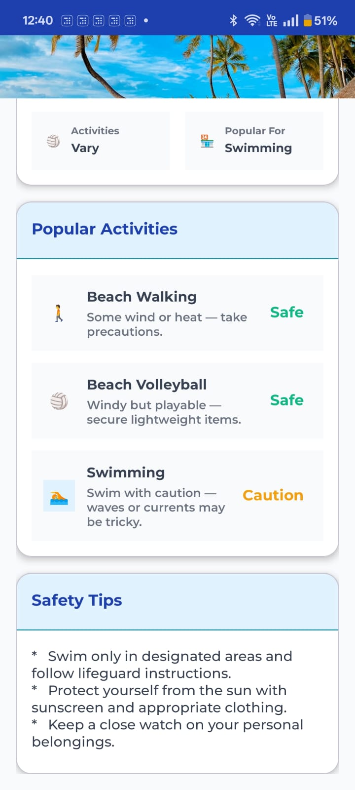 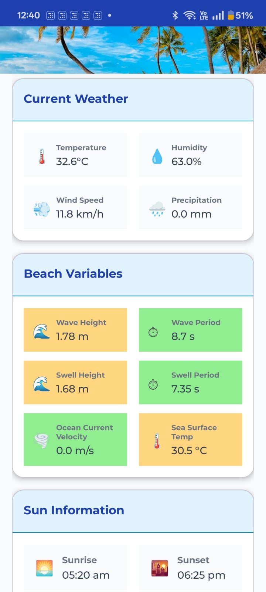 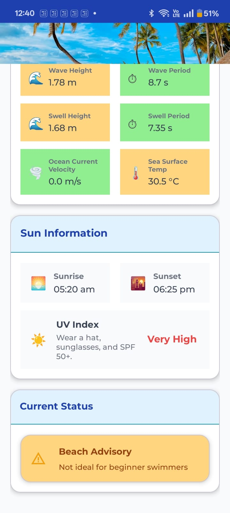

---


## 🤝 User Guide

### 🛠 Setup

1. Clone the repo:

   ```bash
   git clone https://github.com/dev-abhayT/BeachBuddy.git
   cd BeachBuddy
   ```

2. Visit the websites of <b>Foursquare Places API</b>, <b>Unsplash API</b>, and obtain safe API keys (with restrictions for protection against misuse).
3. Visit the <b>Google Cloud Console</b> and <B>Google AI studio</B>, enable the API for <B>Google Maps SDK</B> & <B>Google Gemini</B> respectively and obtain the keys.
2. Go to Android Studio and populate the  `local.properties` file under `.gitignore` with the following placeholders:

   ```properties
   GOOGLE_MAPS_API_KEY=your_google_maps_key
   FSQ_API_KEY=your_foursquare_key
   GEMINI_API_KEY=your_gemini_key
   UNSPLASH_API_KEY=your_unsplash_key
   ```
3. Sync Gradle and run to see BeachBuddy in action!

## 📄 License

This project is licensed under the MIT License. See the `LICENSE` file for details.

---

## 🧑‍💻 Developed By

**Abhay Tiwari**  
📧 Mail: tiwari.abhay2k6@gmail.com  
💻 [GitHub](https://github.com/dev-abhayT)
🌐 [LinkedIn](https://www.linkedin.com/in/abhay-tiwari-1864762a1/)

---
